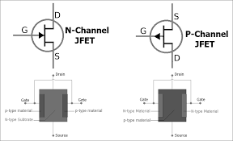

## Procedure

  
**Fig. 1. silicon stack up for P-channel and N-channel JFETs**

  
**Steps to perform the real measurement in HP 4145B / Agilent 4156C Semiconductor Parameter Analyzer**  

1.  Set up the Agilent 4156C Precision Semiconductor Parameter Analyzer and connect it to the computer with the required software interface.
2.  Mount the P-channel JFET on the probe station and carefully position the probes on the source, drain, and gate terminals of the JFET.
3.  Connect the source, drain, and gate terminals to the Agilent 4156C using appropriate connections.
4.  Configure the Agilent 4156C:
    *   Set the source-drain voltage ($$V_{DS}$$) sweep range (e.g., -10V to 0V).
    *   Set the reverse bias voltage at the gate-source ($$V_{GS}$$) from 0V to a suitable negative value (e.g., 0V to -5V).
    *   Define the measurement points and ensure the correct sweep rate and compliance settings.
5.  Turn on the Agilent 4156C and perform the first measurement sweep with VGS set at 0V, recording the $$I_{DS}$$ (Drain Current) and $$V_{DS}$$ (Drain-Source Voltage).
6.  Gradually increase the reverse bias (negative $$V_{GS}$$) in small increments (e.g., -1V, -2V, up to -5V) and record the corresponding IDS and VDS for each step.
7.  Observe and document how increasing reverse bias voltage affects the drain current ($$I_{DS}$$).
8.  Repeat the measurement as necessary for multiple samples to ensure consistency in the results.
9.  Analyze the collected data to determine the impact of reverse biasing on the P-channel JFET’s performance.
10.  Turn off the Agilent 4156C and disconnect the setup carefully.

Conclusion:
-----------

Summarize the observed effects of reverse bias on the P-channel JFET, specifically noting changes in drain current and voltage characteristics with increasing reverse bias.
