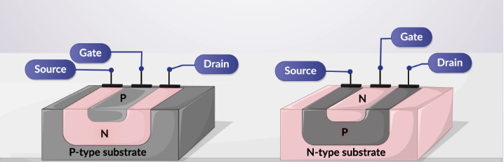

## Theory

 **Introduction:**  
A junction field effect transistor is used in electronic circuits to control electrical currents., JFETs consist of an N-type or P-type silicon bar.

**Fig. 1. Threshold Voltage and Inversion charge**

  

### Biasing of JFET

Biasing a Junction Field Effect Transistor (JFET) is crucial for setting operational parameters and ensuring efficient functioning in electronic circuits. JFETs are characterized by using a single carrier type in N-channel or P-channel configurations, where the channel is surrounded by PN junctions. These junctions are central to the device's ability to control current flow.

P-channel JFET features a P-type semiconductor channel with N-type gate material on either side. In this structure, applying a positive gate voltage to the P-type channel repels the holes, increasing the depletion region and decreasing conductivity. This reverse biasing is critical in controlling the current through the device.

Effective biasing is fundamental for JFETs used as switches or amplifiers. The applied gate-source voltage precisely adjusts the depletion region's width, managing the current flow through the channel. Moreover, the biasing of JFETs also influences characteristics like the AC drain resistance, which typically ranges several hundred ohms, and parameters such as transconductance and amplification factor.

Proper biasing prevents the JFET from operating in undesirable states like saturation or cutoff, optimizing its performance and durability in circuits.

### Gate-Source Junction Reverse Biasing

*   In a P-channel JFET, the gate is typically made of N-type material, and the channel is P-type. To reverse bias the gate-source junction, the gate voltage $$V_G$$ must be more positive relative to the source $$V_S$$.
*   This increases the width of the depletion region around the gate, reducing the effective width of the P-type channel. Consequently, the conductivity of the channel decreases, limiting the current flow from the drain to the source.

### Drain-Source Voltage ($$V_D$$ < 0)

*   For a P-channel JFET, the source is usually at a higher potential than the drain. Hence, $$V_D$$ (the drain voltage relative to the source) is negative.
*   The negative drain voltage means that the drain is at a lower potential compared to the source, allowing holes (the majority carriers in a P-channel JFET) to flow from the source to the drain.

Key Effects and Characteristics
-------------------------------

### Depletion Region Control

The width of the depletion region is controlled by the gate-source voltage. A higher $$V_G$$ results in a wider depletion region, effectively narrowing the conductive channel. This is known as the pinch-off effect.

### Current Flow

When the gate-source junction is reverse biased, the current flow from drain to source is primarily controlled by the voltage difference between the source and the drain. However, the gate voltage can modulate this current by altering the channel width.

### Pinch-off Condition

As the reverse bias voltage increases, the depletion regions from the gate junctions on either side of the channel grow wider and can eventually pinch off the channel. When this occurs, the channel is fully depleted, and the current flow is minimal. This is called the pinch-off condition.

Practical Implications
----------------------

### Amplifier Operation

In analog electronics, a P-channel JFET can be used as a voltage-controlled resistor or as a key component in amplifiers, where the reverse bias voltage on the gate controls the amplification level.

### Switching Applications

In digital circuits, the P-channel JFET can be used as a switch. By applying appropriate gate-source voltages, the JFET can switch between conductive (on) and non-conductive (off) states.

Understanding the behavior of a P-channel JFET in the reverse-biased condition is crucial for designing and optimizing circuits that use these components. The ability to control the channel conductivity via the gate voltage enables versatile applications in both analog and digital electronics.

### Mathematical Model

The expression for the drain current of a p-channel JFET in the linear regime is,

$$\\begin{equation} I_D=I_p\\left\[\frac{V_D}{V_p}-\frac{2}{3}\\left(\frac{V_{bi}+V_D-V_G}{V_p}\\right)^{3/2}+\frac{2}{3}\\left(\frac{V_{bi}-V_G}{V_p}\\right)^{3/2}\\right\], \\end{equation}$$

where,

$$ I_p =-\frac{\mu_p {N_A}^2 Z e^2 h^3}{2L\epsilon_r\epsilon_0} \qquad V_p =-\frac{e {N_A} h^2}{2 \epsilon_r\epsilon_0} \qquad eV_{bi} =k_B T \ln (\frac{N_A N_D}{{n_i}^2}) \qquad n_i=\sqrt{N_cN_v(\frac{T}{300})^{3}}\exp(\frac{-E_g}{2k_BT}). $$
In the saturation regime the current is,

$$\\begin{equation} I\_D=I\_p\\left\[\\frac{1}{3}-\\frac{V\_{bi}-V\_G}{V\_p}+\\frac{2}{3}\\left(\\frac{V\_{bi}-V\_G}{V\_p}\\right)^{3/2}\\right\]. \\end{equation}$$

These expressions are valid assuming that the pn junction is reverse biased. For a p-channel JFET, $$V_G$$ > 0 and $$V_D$$ < 0 in this regime.
 
     
 
